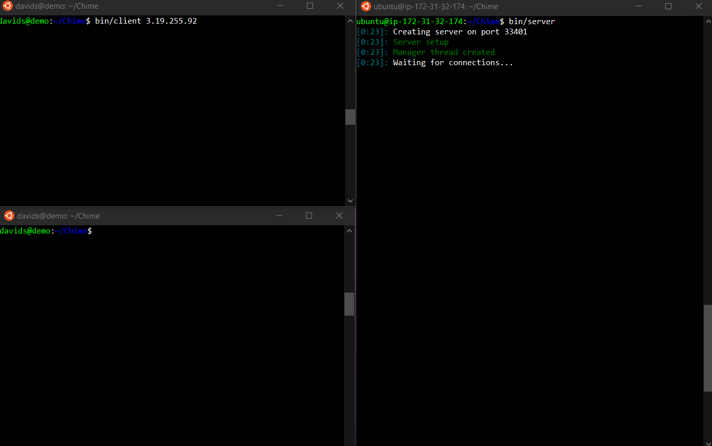

# Chime

## What is Chime?
A very simple TCP Multiplexing Chat application written in C.

## Usage

First, clone the repository to your machine and make the necessary executables.
```bash
git clone https://github.com/Daves1245/Chime.git
cd Chime
make
```
run the server binary
```bash
bin/server
```
on a separate machine (or terminal), run the client executable and pass the ip of the server
```bash
bin/client 127.0.0.1
```
Start chatting away!
(use /exit to leave the chat)

Feel free to try it on my ubuntu instance in the cloud.
```
bin/client 3.19.255.92
```
# Demo

